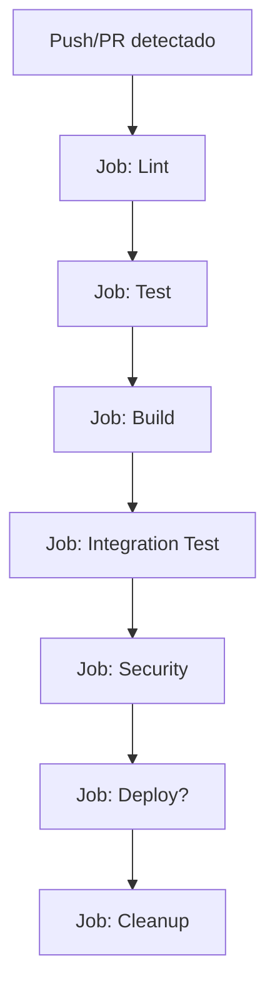

# 🤖 GitHub Actions CI/CD - Guia Para Iniciantes

**Entendendo como funcionam os testes automáticos e deploy**

## 🎯 O Que É CI/CD?

**CI (Continuous Integration)**: Integração Contínua
- Sempre que você faz `git push`, código é testado automaticamente
- Previne bugs chegarem à produção

**CD (Continuous Deployment)**: Deploy Contínuo  
- Se testes passam, código é automaticamente deployado
- Releases são criados automaticamente

### Por Que Você Precisa Disso?

**Sem CI/CD** (método manual):
```bash
# Você precisa lembrar de fazer sempre:
pytest tests/
flake8 src/
docker build .
# Se esquecer algum passo → BUG em produção!
```

**Com CI/CD** (automático):
```bash
git push origin main
# GitHub Actions faz TUDO automaticamente!
# Se algo der errado, você é notificado
```

---

## 📊 GitHub Actions Dashboard

### Como Acessar:

1. **GitHub Web**: Seu repositório → **Actions** tab
2. **Ver execuções**: Lista de todas as execuções
3. **Status visual**:
   - 🟢 **Verde**: Tudo OK
   - 🔴 **Vermelho**: Algo falou
   - 🟡 **Amarelo**: Em execução

### Interface Explicada:

```
GitHub → radar-webscrapping → Actions

📋 Workflows (lado esquerdo):
├── CI/CD                    # Pipeline principal
├── Simple CI              # Pipeline rápido
├── Dependencies            # Atualização automática
├── Release                 # Deploy produção
└── Cleanup                 # Limpeza automática

📊 Execuções (centro):
├── ✅ ci-cd.yml - 15min ago  (main branch)
├── 🔴 ci-cd.yml - 1h ago     (feature-branch) 
└── 🟡 ci-cd.yml - Running    (main branch)
```

---

## 🔍 Workflows Explicados em Detalhes

### 1. **ci-cd.yml** - Pipeline Principal 🚀

#### **Quando Executa:**
- Todo `git push` para `main` ou `develop`
- Todo Pull Request
- Tags `v*.*.*` (releases)

#### **O Que Faz (passo a passo):**



#### **Job 1: Lint (2-3 min)**
```yaml
# O que faz:
- Verifica formatação do código (black)
- Verifica estilo (flake8) 
- Verifica tipos (mypy)
- Verifica imports (isort)

# Se falhar:
❌ "Code style issues found" 
→ Você precisa corrigir formatação
```

#### **Job 2: Test (3-5 min)**
```yaml
# O que faz:
- Sobe PostgreSQL + Redis
- Instala dependências Python
- Executa pytest tests/
- Gera relatório de coverage

# Se falhar:
❌ "Tests failed"
→ Algum teste quebrou, você precisa corrigir
```

#### **Job 3: Build (2-3 min)**
```yaml
# O que faz:
- Faz build da imagem Docker
- Testa se container sobe
- Push para GitHub Packages

# Se falhar:
❌ "Docker build failed"
→ Problema no Dockerfile ou dependências
```

#### **Job 4: Integration Test (3-4 min)**
```yaml
# O que faz:
- Sobe container completo
- Testa se aplicação responde
- Testa endpoints básicos

# Se falhar:
❌ "Integration tests failed"
→ Aplicação não sobe ou não responde
```

#### **Job 5: Security (1-2 min)**
```yaml
# O que faz:
- Scan de vulnerabilidades (Trivy)
- Verifica dependências (Safety)
- Análise de código (Bandit)

# Se falhar:
❌ "Security issues found"
→ Vulnerabilidade encontrada
```

#### **Job 6: Deploy (só para tags)**
```yaml
# O que faz:
- Cria release no GitHub
- Faz build multi-platform
- Publica imagens Docker

# Quando executa:
- Só quando você cria tag: git tag v1.0.0
```

#### **Job 7: Cleanup (1 min)**
```yaml
# O que faz:
- Remove imagens Docker antigas
- Limpa artifacts temporários

# Sempre executa no final
```

### 2. **ci-simple.yml** - Pipeline Rápido ⚡

#### **Quando Executa:**
- Push/PR para `main` e `develop` (paralelo ao principal)

#### **Por Que Existe:**
- Feedback rápido (8-10 min vs 15-20 min)
- Testes essenciais apenas
- Para desenvolvimento ágil

#### **O Que Faz:**
```yaml
# Versão compacta:
- Setup Chrome/ChromeDriver  
- Testes básicos
- Build Docker simples
- Sem security scan extenso
```

### 3. **dependencies.yml** - Atualização Automática 🤖

#### **Quando Executa:**
- **Agendado**: Toda segunda-feira, 9h UTC
- **Manual**: Você pode executar quando quiser

#### **O Que Faz:**
```yaml
# 1. Verifica atualizações disponíveis
pip list --outdated

# 2. Atualiza requirements.txt
pip-compile requirements.in

# 3. Testa se tudo funciona
pytest tests/

# 4. Cria PR automático
gh pr create --title "chore: update dependencies"
```

#### **Resultado:**
- 🤖 PR automático com atualizações
- ✅ Você revisa e faz merge se OK
- 🛡️ Mantém projeto seguro e atualizado

### 4. **release.yml** - Deploy de Produção 🚀

#### **Quando Executa:**
- Quando você cria tag: `git tag v1.0.0`
- Manual (para emergências)

#### **O Que Faz:**
```yaml
# 1. Validação pré-release
- Verifica formato da versão
- Testa build completo

# 2. Build multi-platform  
- Docker para AMD64 + ARM64
- Testes em diferentes arquiteturas

# 3. Publica release
- Cria release no GitHub
- Upload das imagens Docker
- Gera changelog automático

# 4. Notifica integração
- Webhook para radar-infra
- Notificação de nova versão
```

### 5. **cleanup.yml** - Manutenção 🧹

#### **Quando Executa:**
- **Agendado**: Todo domingo, 2h UTC
- **Manual**: Quando repositório ficar "pesado"

#### **O Que Faz:**
```yaml
# Limpeza automática:
- Remove cache antigo (>7 dias)
- Remove imagens Docker antigas (>30 dias)  
- Remove artifacts antigos (>90 dias)
- Health check do repositório
```

---

## 🔔 Entendendo Notificações

### Quando Você Recebe Email:

#### ❌ **Workflow Falhou**
```
Subject: [radar-webscrapping] Run failed: CI/CD - main (a1b2c3d)

Your workflow run "CI/CD" has failed.
View details: https://github.com/...
```

**O que fazer:**
1. Clique no link para ver detalhes
2. Identifique qual job falhou
3. Leia os logs de erro
4. Corrija o problema
5. Faça novo push

#### ✅ **Workflow Passou (primeira vez após falha)**
```
Subject: [radar-webscrapping] Run completed: CI/CD - main (a1b2c3d)

Your workflow run "CI/CD" has completed successfully.
```

#### 🤖 **Dependabot PR Criado**
```
Subject: [radar-webscrapping] New PR: Update dependencies

Dependabot has created a new pull request to update your dependencies.
Review: https://github.com/...
```

### Como Configurar Notificações:

```bash
# GitHub Settings → Notifications
# Customize para receber apenas:
☑️ Failures (falhas)
☑️ First success after failure  
☐ All workflow runs (muito spam)
```

---

## 🔍 Interpretando Logs de Erro

### Cenário 1: Lint Falhou

#### **Log de Erro:**
```
Run flake8 src/
src/scrapers/curso_scraper.py:45:80: E501 line too long (85 > 79 characters)
src/scrapers/curso_scraper.py:52:1: F401 'requests' imported but unused
##[error]Process completed with exit code 1
```

#### **Como Corrigir:**
```bash
# Localmente:
docker-compose exec webscrapping flake8 src/
docker-compose exec webscrapping black src/  # Auto-format

# Commit e push novamente
git add .
git commit -m "fix: corrigir problemas de linting"
git push origin main
```

### Cenário 2: Testes Falharam

#### **Log de Erro:**
```
FAILED tests/test_curso_scraper.py::test_buscar_cursos - AssertionError: assert [] == ['MAT001', 'MAT002']
>       assert resultado == expected
E       assert [] == ['MAT001', 'MAT002']
```

#### **Como Corrigir:**
```bash
# Debug local:
docker-compose exec webscrapping pytest tests/test_curso_scraper.py::test_buscar_cursos -v

# Corrigir código ou teste
# Commit e push
```

### Cenário 3: Docker Build Falhou

#### **Log de Erro:**
```
Step 8/15 : RUN pip install -r requirements.txt
ERROR: Could not find a version that satisfies the requirement unknown-package==1.0.0
##[error]Process completed with exit code 1
```

#### **Como Corrigir:**
```bash
# Verificar requirements.txt
# Corrigir dependência problemática
# Testar build local:
docker build -t test .

# Commit e push
```

---

## 🎯 Workflow de Desenvolvimento

### Cenário Completo: "Implementar nova feature"

#### **Dia 1 - Começar Feature**

```bash
# 1. Criar branch
git checkout -b feature/nova-funcionalidade

# 2. Desenvolver...
# (seus códigos)

# 3. Commit inicial
git add .
git commit -m "feat: iniciar implementação nova funcionalidade"
git push origin feature/nova-funcionalidade
```

**GitHub Actions:**
- ✅ Executa `ci-cd.yml` na sua branch
- ✅ Feedback em ~15 minutos
- ❌ Se falhar, corrige e push novamente

#### **Dia 2 - Continuar Feature**

```bash
# 4. Mais desenvolvimento...
git add .
git commit -m "feat: adicionar lógica de validação"
git push origin feature/nova-funcionalidade
```

**GitHub Actions:**
- ✅ Testa novamente
- ✅ Build da sua branch

#### **Dia 3 - Finalizar Feature**

```bash
# 5. Testes finais locais
docker-compose exec webscrapping pytest tests/

# 6. Commit final
git add .
git commit -m "feat: finalizar nova funcionalidade com testes"
git push origin feature/nova-funcionalidade

# 7. Criar Pull Request
# GitHub → Compare & pull request
```

**GitHub Actions:**
- ✅ Executa testes no PR
- ✅ Status aparece no PR
- ✅ Só permite merge se CI passou

#### **Dia 4 - Merge e Deploy**

```bash
# 8. Merge no GitHub (só se CI passou)
# GitHub → Merge pull request

# 9. Limpar localmente
git checkout main
git pull origin main
git branch -d feature/nova-funcionalidade

# 10. Para deploy em produção (opcional)
git tag v1.0.0
git push origin v1.0.0
```

**GitHub Actions:**
- ✅ `ci-cd.yml` executa no main
- ✅ `release.yml` executa na tag
- ✅ Deploy automático para produção

---

## 🛠️ Comandos Úteis para CI/CD

### GitHub CLI (Opcional, mas útil):

#### **Instalação:**
```bash
# Windows (via Chocolatey)
choco install gh

# Ou baixar: https://cli.github.com/
```

#### **Comandos Úteis:**
```bash
# Ver workflows
gh workflow list

# Executar workflow manualmente
gh workflow run ci-cd.yml

# Ver execuções recentes
gh run list

# Ver detalhes de execução
gh run view [run-id]

# Ver logs de falha
gh run view [run-id] --log-failed
```

### Executar GitHub Actions Localmente:

#### **Com act (Simulador local):**
```bash
# Instalar act
# https://github.com/nektos/act

# Executar workflow localmente
act push                    # Simular push
act -j lint                # Executar job específico
act --list                 # Ver ações disponíveis
```

---

## 📊 Monitoramento e Métricas

### Métricas Importantes:

#### **Build Time**
- **Objetivo**: < 15 minutos para CI/CD completo
- **Atual**: ~12-18 minutos (dentro do esperado)
- **Como melhorar**: Cache de dependências

#### **Success Rate**
- **Objetivo**: > 95%
- **Monitor**: GitHub Insights → Actions

#### **Coverage**
- **Objetivo**: > 80%
- **Monitor**: Relatórios de coverage nos logs

### Como Acompanhar:

#### **GitHub Insights:**
```
Seu repo → Insights → Actions
- Build times
- Success rates  
- Most failing workflows
```

#### **Logs Estruturados:**
```bash
# Ver métricas nos logs
grep "duration" logs/github-actions.log
grep "coverage" logs/test-coverage.log
```

---

## 🚨 Troubleshooting Comum

### Problema 1: "CI demora muito"

#### **Sintomas:**
- Workflows levam > 25 minutos
- Timeout em jobs

#### **Soluções:**
```yaml
# 1. Verificar cache
- uses: actions/cache@v3
  with:
    path: ~/.cache/pip
    key: ${{ runner.os }}-pip-${{ hashFiles('**/requirements.txt') }}

# 2. Paralelizar jobs
jobs:
  lint:
    runs-on: ubuntu-latest
  test:
    runs-on: ubuntu-latest  
    # Jobs executam em paralelo

# 3. Reduzir escopo de testes em PR
if: github.event_name == 'pull_request'
```

### Problema 2: "Testes passam local, falham CI"

#### **Causas Comuns:**
- Diferenças de ambiente
- Timezone diferente
- Dependências não pinadas

#### **Soluções:**
```bash
# 1. Testar com mesmo ambiente
docker run --rm -it python:3.11-slim bash
pip install -r requirements.txt
pytest tests/

# 2. Pinar dependências
pip freeze > requirements.txt

# 3. Usar fixtures determinísticas
@pytest.fixture
def fixed_datetime():
    return datetime(2024, 1, 1, 12, 0, 0, tzinfo=timezone.utc)
```

### Problema 3: "Deploy falha"

#### **Log típico:**
```
Error: buildx failed with: ERROR: failed to push
permission denied
```

#### **Soluções:**
```bash
# 1. Verificar permissões GitHub
# Settings → Actions → General → Workflow permissions
☑️ Read and write permissions

# 2. Verificar secrets
# Settings → Secrets and variables → Actions
# GITHUB_TOKEN deve existir (automático)

# 3. Verificar tag format
git tag v1.0.0  # Correto: v + semantic version
git tag 1.0.0   # Incorreto: sem 'v'
```

---

## 🎓 Boas Práticas

### Para Commits:

#### **Sempre:**
```bash
# Commits pequenos e focados
git commit -m "feat: adicionar validação de URL"
git commit -m "test: adicionar teste para validação"
git commit -m "docs: atualizar README com nova funcionalidade"
```

#### **Nunca:**
```bash
# Commits gigantes
git commit -m "implementar tudo"  # ❌

# Commits sem descrição
git commit -m "fix"  # ❌

# Commits que quebram CI
git commit -m "WIP - não funciona ainda"  # ❌
```

### Para Branches:

#### **Nomenclatura:**
```bash
feature/nova-funcionalidade     # ✅
bugfix/corrigir-scraper        # ✅
hotfix/vulnerabilidade-critica # ✅

fix                            # ❌ muito genérico
jamil-branch                   # ❌ nome pessoal
```

### Para Pull Requests:

#### **Sempre incluir:**
- Descrição clara do que mudou
- Por que mudou
- Como testar
- Screenshots (se UI)
- Links para issues relacionadas

---

## 🎯 Próximos Passos

### Semana 1: Familiarização
- [ ] Fazer primeiro push e ver CI executar
- [ ] Propositalmente quebrar teste e ver falha
- [ ] Corrigir e ver CI passar
- [ ] Entender logs de cada job

### Semana 2: Domínio
- [ ] Trabalhar com branches e PRs
- [ ] Configurar notificações
- [ ] Usar GitHub CLI
- [ ] Otimizar tempo de CI

### Semana 3: Maestria
- [ ] Customizar workflows
- [ ] Adicionar novos checks
- [ ] Configurar deploy automático
- [ ] Monitorar métricas

---

**🎉 Agora você entende todo o sistema de CI/CD!**

**Lembre-se:**
- ✅ GitHub Actions é seu amigo - ele previne bugs
- ✅ CI/CD economiza seu tempo a longo prazo
- ✅ Sempre corrija problemas de CI imediatamente
- ✅ Use branches para features grandes
- ✅ Confie no processo - ele funciona!

**Desenvolvimento seguro e automatizado! 🚀**